# Base Skill + Specification Model

## Refined Mental Model

Master Skills are actually **BASE SKILLS** that are **tagged with hierarchical specifications** to represent different contexts, applications, and complexity levels.

---

## Conceptual Framework

```mermaid
graph TD
    Base["🎯 BASE SKILL<br/>Capitalize"]
    
    Base --> Spec1["Specification: 'I'<br/>(specific word)"]
    Base --> Spec2["Specification: First Letter<br/>(sentence context)"]
    Base --> Spec3["Specification: Proper Nouns<br/>(grammatical category)"]
    
    Spec3 --> Sub1["Sub-spec: Days of Week<br/>(Monday, Tuesday...)"]
    Spec3 --> Sub2["Sub-spec: Months<br/>(January, February...)"]
    Spec3 --> Sub3["Sub-spec: People<br/>(names/titles)"]
    
    classDef baseStyle fill:#4caf50,stroke:#2e7d32,stroke-width:4px,color:#fff,font-weight:bold
    classDef specStyle fill:#2196f3,stroke:#1565c0,stroke-width:2px,color:#fff
    classDef subStyle fill:#ff9800,stroke:#e65100,stroke-width:2px,color:#fff
    
    class Base baseStyle
    class Spec1,Spec2,Spec3 specStyle
    class Sub1,Sub2,Sub3 subStyle
```



---

## Structure

### Base Skill
The **core competency** - what the learner must be able to do

**Example**: Capitalize

### Specifications (Tags)
**Contextual applications** of the base skill - where/when/how it's applied

**Types of Specifications**:
1. **Context Specs**: Where the skill is applied (sentence, paragraph, essay)
2. **Content Specs**: What content the skill applies to (proper nouns, "I", titles)
3. **Complexity Specs**: How complex the application is (with support, independently, critically)
4. **Text Specs**: What type of text (fictional, informational, mixed)
5. **Grade Specs**: Developmental level (K-2, 3-5, 6-8, 9-12)

### Hierarchical Sub-Specifications
Specifications can have **nested subcategories** for finer granularity

---

## Real-World Example: "Main Idea"


---

## How ROCK Skills Map

ROCK skills are **base skill + specification combinations**:

### Example ROCK Skills → Base + Specs

| ROCK Skill | Base Skill | Specifications |
|------------|-----------|----------------|
| "Determine main idea with support (Grade K)" | Determine Main Idea | • complexity: with_support<br/>• grade: K<br/>• text_type: informational |
| "Determine main idea independently (Grade 3)" | Determine Main Idea | • complexity: independent<br/>• grade: 3<br/>• text_type: mixed |
| "Analyze development of central idea (Grade 8)" | Determine Main Idea | • complexity: analytical<br/>• grade: 8<br/>• text_type: informational |
| "Evaluate author's development of multiple central ideas (Grade 12)" | Determine Main Idea | • complexity: evaluative<br/>• grade: 12<br/>• text_type: literary<br/>• quantity: multiple |

---

## Specification Taxonomy

### 1. **Text Specifications**
```
text_type:
  - fictional
  - informational
  - mixed
  - not_applicable

text_mode:
  - prose
  - poetry
  - drama
  - mixed
  - not_applicable

text_genre:
  - narrative
  - expository
  - argumentative
  - procedural
  - literary
```

### 2. **Complexity Specifications**
```
complexity_level: 0-14 (grade-based)

complexity_band:
  - K-2 (foundational)
  - 3-5 (intermediate)
  - 6-8 (advanced)
  - 9-12 (sophisticated)

cognitive_demand:
  - recall
  - comprehension
  - application
  - analysis
  - synthesis
  - evaluation
```

### 3. **Support Specifications**
```
support_level:
  - with_support
  - with_prompting
  - independently
  - autonomously

support_type:
  - visual_aids
  - teacher_prompting
  - peer_collaboration
  - graphic_organizers
  - scaffolding
```

### 4. **Domain Specifications**
```
skill_domain:
  - reading
  - writing
  - speaking
  - listening
  - language

subdomain:
  - comprehension
  - vocabulary
  - fluency
  - phonics
  - grammar
```

### 5. **Scope Specifications**
```
scope:
  - word_level
  - sentence_level
  - paragraph_level
  - text_level
  - multi_text

quantity:
  - single
  - multiple
  - comparing
```

---

## Benefits of Base + Specification Model

### 1. **Content Scaling**
Tag content once to BASE SKILL → automatically inherits all specification variants

**Example**:
```
Content: "Main Idea Video Lesson"
Tagged to: BASE[Determine Main Idea]

Automatically discoverable for:
- Grade 3 + informational + independent
- Grade 5 + fictional + analytical
- Grade 8 + literary + critical
- All 15 state variants
```

### 2. **Semantic Precision**
Separates WHAT (base skill) from WHERE/WHEN/HOW (specifications)

### 3. **Hierarchical Organization**
Natural parent-child relationships for specifications

### 4. **Flexible Querying**
```sql
-- Find all "Main Idea" skills for Grade 5
SELECT * WHERE base_skill = "Determine Main Idea" 
  AND grade_spec = "5"

-- Find all reading skills with informational text
SELECT * WHERE skill_domain = "reading" 
  AND text_type = "informational"
```

### 5. **Cross-State Mapping**
Different states = different specification combinations on same base skill

### 6. **Progression Tracking**
Same base skill, increasing complexity specifications

---

## Implementation in Master Skill Spine

### Current Data Structure

```csv
MASTER_CONCEPT_ID,MASTER_CONCEPT_NAME,COMPLEXITY_BAND,TEXT_TYPE,TEXT_MODE,SKILL_DOMAIN
MC-SA-0045,Determine Main Idea,K-2,informational,prose,reading
MC-SA-0046,Determine Main Idea,3-5,informational,prose,reading
MC-SA-0047,Determine Main Idea,6-8,mixed,prose,reading
```

### Refined Structure (Base + Specs)

```csv
BASE_SKILL_ID,BASE_SKILL_NAME,SPECIFICATION_TYPE,SPECIFICATION_VALUE,SPEC_HIERARCHY
BS-001,Determine Main Idea,text_type,informational,1
BS-001,Determine Main Idea,text_mode,prose,1
BS-001,Determine Main Idea,complexity_band,K-2,1
BS-001,Determine Main Idea,skill_domain,reading,1
BS-001,Determine Main Idea,support_level,with_support,2
```

---

## Specification Hierarchy Levels

**Level 1: Primary Specifications**
- Text type (fictional/informational)
- Complexity band (K-2, 3-5, etc.)
- Skill domain (reading/writing)

**Level 2: Secondary Specifications**
- Text mode (prose/poetry)
- Support level (with support/independent)
- Cognitive demand (comprehension/analysis)

**Level 3: Tertiary Specifications**
- Text genre (narrative/expository)
- Scope (word/sentence/paragraph)
- Quantity (single/multiple)

---

## Mapping ROCK Skills to Base + Specs

### Step 1: Extract Base Skill
```python
def extract_base_skill(skill_name: str) -> str:
    """Remove specifications to get base skill."""
    # Remove grade references
    skill_name = re.sub(r'\(Grade \d+\)', '', skill_name)
    # Remove support qualifiers
    skill_name = re.sub(r'with support,?', '', skill_name)
    # Remove complexity qualifiers
    skill_name = re.sub(r'independently|critically|analytically', '', skill_name)
    return skill_name.strip()
```

**Example**:
- Input: "Determine main idea with support (Grade K)"
- Output: "Determine main idea"

### Step 2: Extract Specifications
```python
def extract_specifications(skill_name: str, metadata: dict) -> list:
    """Extract all specifications from skill and metadata."""
    specs = []
    
    # From skill name
    if "with support" in skill_name:
        specs.append({"type": "support_level", "value": "with_support"})
    
    # From metadata
    if metadata.get('text_type'):
        specs.append({"type": "text_type", "value": metadata['text_type']})
    
    # From grade
    if metadata.get('grade_level'):
        specs.append({"type": "complexity_band", 
                     "value": determine_band(metadata['grade_level'])})
    
    return specs
```

### Step 3: Build Hierarchy
```python
def build_spec_hierarchy(base_skill: str, specs: list) -> dict:
    """Organize specifications hierarchically."""
    return {
        "base_skill": base_skill,
        "primary_specs": filter_by_level(specs, 1),
        "secondary_specs": filter_by_level(specs, 2),
        "tertiary_specs": filter_by_level(specs, 3)
    }
```

---

## Visual: Three-Vector Strategy + Base/Spec Model

```mermaid
flowchart TB
    %% Three Vectors
    TopDown["🔬 TOP-DOWN<br/>Scientific Frameworks<br/>→ Define BASE SKILLS<br/>→ Validate spec taxonomy"]
    
    BottomUp["📊 BOTTOM-UP<br/>ROCK Skills Data<br/>→ Discover base skills<br/>→ Extract specifications"]
    
    Lateral["📚 LATERAL<br/>Curriculum Resources<br/>→ Validate base skills<br/>→ Confirm specs in practice"]
    
    %% Convergence to Base Skills
    TopDown --> BaseSkills
    BottomUp --> BaseSkills
    Lateral --> BaseSkills
    
    BaseSkills["🎯 BASE SKILLS<br/>(Core Competencies)"]
    
    %% Specification Extraction
    BottomUp --> SpecExtract["📋 Specification<br/>Extraction"]
    TopDown --> SpecTax["📚 Specification<br/>Taxonomy"]
    
    SpecExtract --> Specs["🏷️ SPECIFICATIONS<br/>(Tags/Attributes)"]
    SpecTax --> Specs
    
    %% Master Skill Spine
    BaseSkills --> Spine["🌟 MASTER SKILL SPINE<br/>━━━━━━━━━━━━━━━━<br/>Base Skills + Specifications<br/>━━━━━━━━━━━━━━━━<br/>• Hierarchical tags<br/>• Flexible querying<br/>• Content scaling<br/>• Cross-state bridge"]
    Specs --> Spine
    
    %% Outputs
    Spine --> Mapping["ROCK Skill → Base + Specs Mapping"]
    
    classDef vectorStyle fill:#e3f2fd,stroke:#1565c0,stroke-width:2px
    classDef baseStyle fill:#4caf50,stroke:#2e7d32,stroke-width:3px,font-weight:bold
    classDef specStyle fill:#ff9800,stroke:#e65100,stroke-width:3px
    classDef spineStyle fill:#c8e6c9,stroke:#388e3c,stroke-width:4px,font-weight:bold
    classDef outputStyle fill:#ffccbc,stroke:#d84315,stroke-width:2px
    
    class TopDown,BottomUp,Lateral vectorStyle
    class BaseSkills baseStyle
    class SpecExtract,SpecTax,Specs specStyle
    class Spine spineStyle
    class Mapping outputStyle
```



---

## Example: Complete Skill Decomposition

### ROCK Skill
"Analyze the development of complex characters over the course of the narrative and how they interact with other characters and advance the plot or develop the theme (Grade 8)"

### Decomposition

**BASE SKILL**: Analyze Character Development

**PRIMARY SPECIFICATIONS**:
- complexity_band: 6-8
- skill_domain: reading
- text_type: fictional
- cognitive_demand: analysis

**SECONDARY SPECIFICATIONS**:
- text_mode: prose
- scope: narrative_level
- element_focus: characters
- complexity_qualifier: complex

**TERTIARY SPECIFICATIONS**:
- interaction_type: character_to_character
- impact_analysis: plot_advancement
- impact_analysis: theme_development

---

## Next Steps: Implementation

### 1. Schema Update
Add `BASE_SKILL_ID` and specification columns to master-concepts.csv

### 2. Extraction Pipeline
Enhance metadata extractor to identify base skill + specs

### 3. Query Interface
Enable filtering by base skill + any combination of specs

### 4. Content Tagging
Update content tagging to use base skill IDs with specification filters

---

**Mental Model**: Master Skills = **BASE SKILLS** (core competencies) + **HIERARCHICAL SPECIFICATIONS** (context/application tags)

**Value**: Separates WHAT from WHERE/WHEN/HOW, enables flexible querying, scalable content tagging, and precise semantic mapping

