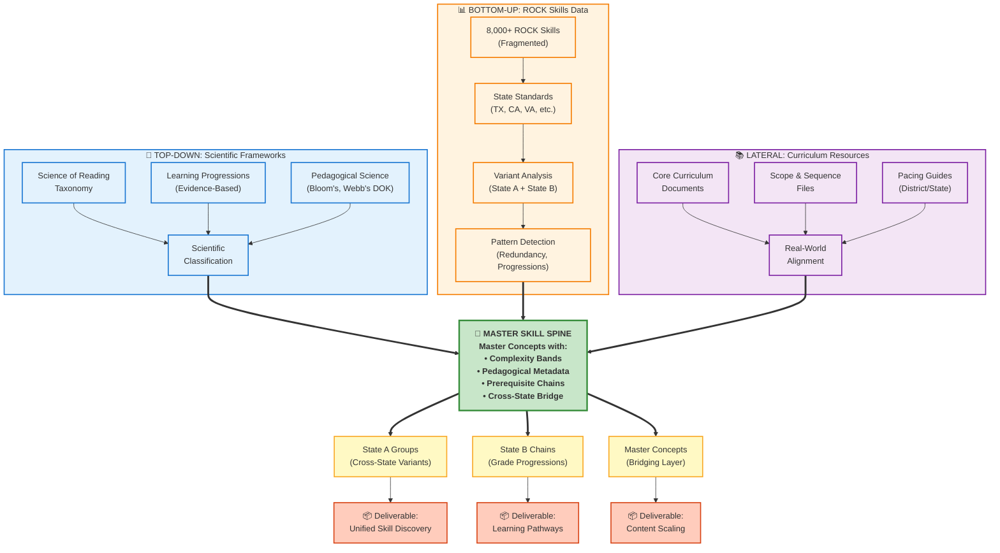

# Master Skill Spine: Three-Vector Strategic Approach

## Overview

The Master Skill Spine is derived through a convergent three-vector strategy that combines:
1. **Bottom-Up**: Data-driven analysis of ROCK skills and standards
2. **Top-Down**: Scientific frameworks and evidence-based taxonomies
3. **Lateral**: Core curriculum documents and scope & sequence alignment

---

## Strategic Diagram



---

## Vector Descriptions

### 🔬 Top-Down: Scientific Frameworks

**Purpose**: Provide evidence-based structure and classification

**Sources**:
- **Science of Reading Taxonomy** (1,140 nodes)
  - 6-level hierarchy: Strand → Pillar → Domain → Skill Area → Skill Set → Skill Subset
  - Evidence-based literacy framework
  - Grade-independent cognitive constructs
  
- **Learning Progressions**
  - Research-validated developmental sequences
  - Cognitive science foundations
  - Prerequisite relationships

- **Pedagogical Science**
  - Bloom's Taxonomy (cognitive demand)
  - Webb's Depth of Knowledge
  - Task complexity frameworks

**Contribution**: Ensures master concepts align with learning science and are pedagogically sound

---

### 📊 Bottom-Up: ROCK Skills Data

**Purpose**: Ground concepts in actual standards and usage patterns

**Sources**:
- **8,000+ ROCK Skills**
  - Derived from 50+ state standards
  - Real-world skill descriptions
  - Grade-level assignments
  
- **State Standards Alignment**
  - TX TEKS, CA CCSS, VA SOL, etc.
  - Authority and jurisdiction metadata
  - Historical usage data

- **Variant Analysis**
  - **State A**: Cross-state variants (126 groups, 264 skills)
  - **State B**: Grade progressions (224 chains, 652 skills)
  - Pattern detection via semantic similarity

**Contribution**: Reveals redundancy, identifies natural concept groupings, discovers spiraled skills

---

### 📚 Lateral: Curriculum Resources

**Purpose**: Validate against real-world instructional practice

**Sources**:
- **Core Curriculum Documents**
  - Publisher curriculum frameworks
  - District adoption materials
  - Instructional scope documents

- **Scope & Sequence Files**
  - Year-long pacing guides
  - Unit planning structures
  - Lesson-level granularity

- **Pacing Guides**
  - District-level instructional calendars
  - State-recommended sequences
  - Assessment alignment maps

**Contribution**: Ensures concepts match how teachers actually organize and teach content

---

## Convergence Process

### Step 1: Bottom-Up Analysis
```
ROCK Skills (8,000+)
    ↓ Variant Classification
State A Groups (126) + State B Chains (224)
    ↓ Semantic Similarity + LLM Analysis
Candidate Master Concepts (~100)
```

### Step 2: Top-Down Classification
```
Science of Reading Taxonomy
    ↓ LLM Mapping (Claude Sonnet 4.5)
Taxonomy Paths for ROCK Skills (1,800 mapped)
    ↓ Consensus Path Selection
Master Concept Naming & Hierarchy
```

### Step 3: Lateral Validation
```
Core Curriculum Documents
    ↓ Alignment Analysis
Scope & Sequence Matching
    ↓ Instructional Reality Check
Validated Master Concepts
```

### Step 4: Integration
```
Bottom-Up Patterns + Top-Down Structure + Lateral Validation
    ↓ Synthesis
Master Skill Spine with:
    • Complexity Bands (K-2, 3-5, 6-8, 9-12)
    • Pedagogical Metadata (text_type, text_mode, skill_domain)
    • Prerequisite Chains (spiraled skills)
    • Cross-State Bridge (State A groups)
```

---

## Deliverables

### 🎯 Master Skill Spine Components

1. **State A Groups** (Cross-State Variants)
   - 126 groups bridging 264 skills
   - Same concept, different state expressions
   - Average 2.0 states per concept
   - **Use Case**: Content tagged to one master concept discoverable across all states

2. **State B Chains** (Grade Progressions)
   - 224 chains spanning 652 skills
   - Skills that spiral K-12
   - Complexity levels (0-14)
   - Prerequisite tracking
   - **Use Case**: Learning pathways showing skill development

3. **Master Concepts** (Bridging Layer)
   - 99 unified concepts
   - Complexity bands (K-2, 3-5, 6-8, 9-12)
   - Pedagogical metadata (text type, mode, domain)
   - Science of Reading alignment
   - **Use Case**: Single anchor point for content scaling across 50+ states

---

## Benefits of Three-Vector Approach

### Why Bottom-Up?
✅ **Grounded in Reality**: Uses actual standards and skills as deployed  
✅ **Pattern Discovery**: Reveals hidden redundancy and fragmentation  
✅ **Data-Driven**: Objective semantic analysis, not subjective interpretation  

### Why Top-Down?
✅ **Scientific Validity**: Aligned with evidence-based frameworks  
✅ **Pedagogical Sound**: Follows learning science principles  
✅ **Consistent Taxonomy**: Structured hierarchy prevents ad-hoc classification  

### Why Lateral?
✅ **Practical Alignment**: Matches how teachers actually teach  
✅ **Instructional Relevance**: Fits existing curriculum structures  
✅ **Real-World Validation**: Confirms concepts work in practice  

### Why All Three?
🎯 **Convergent Validity**: Multiple independent sources confirm concept boundaries  
🎯 **Comprehensive Coverage**: No gaps, no arbitrary divisions  
🎯 **Stakeholder Alignment**: Satisfies assessment, curriculum, and pedagogy needs  

---

## Example: "Main Idea" Master Concept

### Bottom-Up Evidence
- **State A**: 4 variant skills across TX, CA, VA at Grade 3
  - "Determine the main idea" (TX)
  - "Identify main idea with supporting details" (CA)
  - "Find central idea of informational text" (VA)
  
- **State B**: 12-grade progression chain (K-12)
  - Level 0 (K): "With support, identify topic"
  - Level 2 (Grade 1): "Identify main topic"
  - Level 4 (Grade 3): "Determine main idea independently"
  - Level 9 (Grade 8): "Analyze development of central idea"
  - Level 13 (Grade 12): "Evaluate author's development of multiple central ideas"

### Top-Down Classification
- **Science of Reading Path**:
  - Language Comprehension > Comprehension > Comprehension Strategies > During Reading > Determining Importance > Identifying Main Ideas

- **Complexity**: Intermediate (requires inference)
- **Cognitive Demand**: Comprehension → Analysis (grades K-12)

### Lateral Validation
- Core Curriculum: "Main Idea" units in Grades 2-5
- Scope & Sequence: Introduced Grade 2, mastered Grade 4
- Pacing: 2-3 week unit, typically fall semester

### Resulting Master Concept
```
MASTER_CONCEPT_ID: MC-SA-0045
MASTER_CONCEPT_NAME: Main Idea Identification
SOR_PILLAR: Comprehension
COMPLEXITY_BAND: K-2, 3-5, 6-8, 9-12 (spiraled)
TEXT_TYPE: informational
SKILL_DOMAIN: reading
SKILL_COUNT: 16 variants
AUTHORITY_COUNT: 5 states
PREREQUISITE: Topic Identification
```

---

## Implementation Status

✅ **Bottom-Up**: Complete (3,000 ELA skills analyzed)  
✅ **Top-Down**: Complete (1,800 skills mapped to Science of Reading)  
⏳ **Lateral**: Planned (curriculum document analysis)  
✅ **Integration**: Complete (99 master concepts generated)  

---

**Strategic Approach**: Three-Vector Convergence  
**Result**: Master Skill Spine (Bridging Layer)  
**Value**: Unified, scientifically-grounded, practically-validated skill taxonomy

