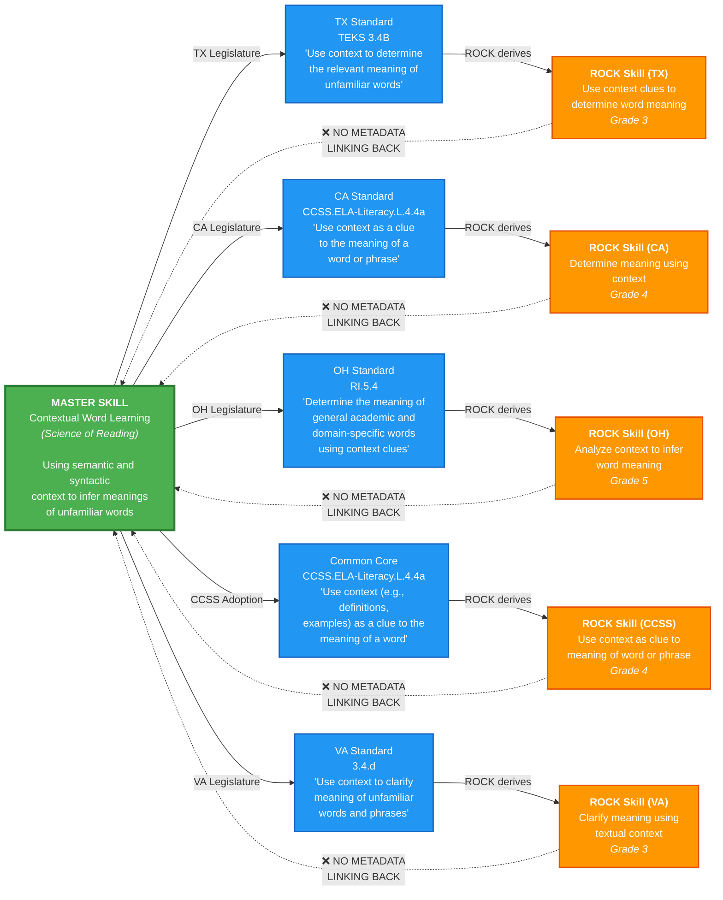
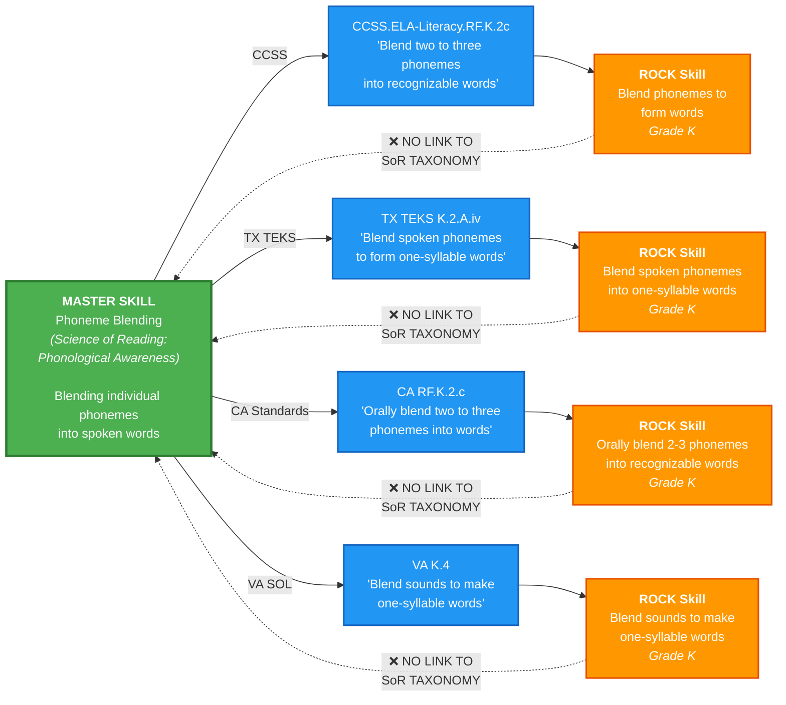
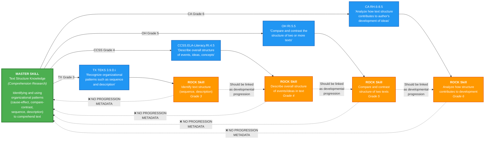
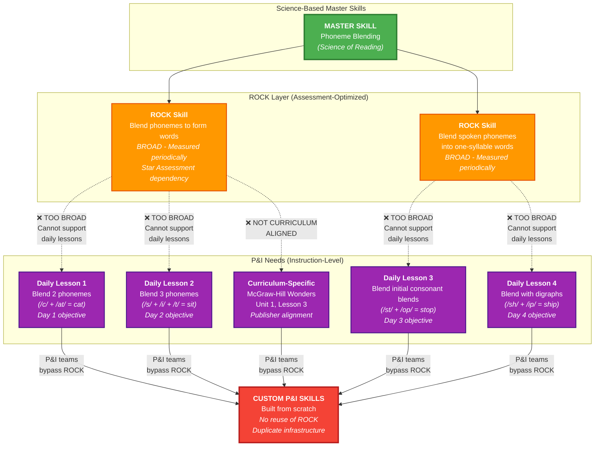
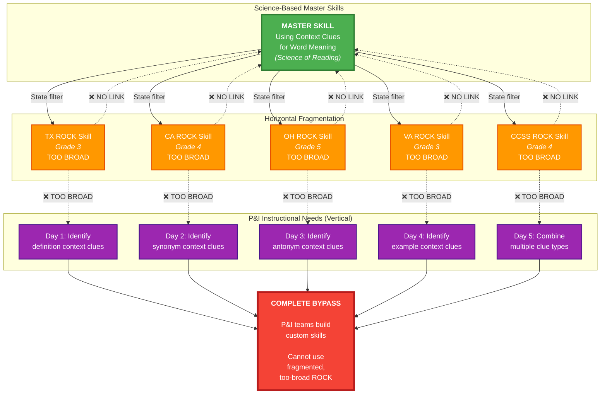

# The Compound ROCK Skills Problem

**Visual Diagrams**: How ROCK faces two interrelated architectural challenges—horizontal fragmentation and vertical granularity mismatch

---

## Overview: Two Dimensions of the Problem

ROCK Skills face a **compound architectural problem** with two distinct but related dimensions:

1. **Horizontal Fragmentation**: Same science-based concept → 8-15 redundant ROCK skills across states
2. **Vertical Granularity Mismatch**: ROCK skills too broad for daily instruction; P&I needs finer-grained objectives

**The Combined Effect**: ROCK is both redundant (too many similar skills) AND too coarse (each skill too broad for instruction), making it difficult to use for either discovery or daily teaching.

---

## Problem 1: Horizontal Fragmentation (Master Skill Redundancy)

The following diagram shows how a single evidence-based literacy competency (from the Science of Reading) branches into multiple state-specific standards, which then generate redundant ROCK skills **with no backward linkage to the master concept**.



---

## What the Diagram Shows

### Left: Science-Based Master Skill
**The Source of Truth**
- Evidence-based competency from learning science (Science of Reading, Mathematics Learning Progressions, etc.)
- Grade-independent conceptual definition
- Grounded in research on how students learn
- Example: "Contextual Word Learning" – using context to infer word meanings

### Middle: State Legislative Filter
**The Fragmentation Layer**
- Each state legislature creates its own standards document
- Standards express the master concept with:
  - Different terminology ("context clues" vs. "textual context" vs. "surrounding words")
  - Different scope (some narrow, some broad)
  - Different grade-level assignments (Grade 3 vs. Grade 4 vs. Grade 5)
  - Different performance indicators
- Common Core State Standards (CCSS) attempted uniformity, but:
  - Not all states adopted CCSS
  - States that adopted CCSS still created supplemental standards
  - Even CCSS-aligned skills show variation in implementation

### Right: ROCK Skills (Fragmented Endpoints)
**The Redundancy Problem**
- ROCK creates skills by mapping to state standards
- **Result**: 5-15+ ROCK skills teaching the same underlying competency
- Each skill is independently defined with:
  - Unique SKILL_ID
  - State-specific description
  - Different grade-level defaults
  - Separate content libraries
  - Independent assessment items
- **Critical Gap**: No field or metadata linking skills back to master concept

### Bottom: Missing Backward Linkage (Dotted Lines)
**The Core Problem**
- ❌ No taxonomic metadata connecting ROCK skills to master competencies
- ❌ No Science of Reading taxonomy references
- ❌ No cognitive construct tags
- ❌ No equivalence or similarity metadata
- ❌ No learning progression hierarchies

**Impact**: You cannot programmatically ask ROCK:
- "Show me all skills that teach contextual word learning"
- "What are the conceptually equivalent skills across states?"
- "Which skills form a developmental progression for this competency?"
- "Are we missing coverage of any Science of Reading components?"

---

## Real-World Example: Phonemic Blending



**Observation**: All four skills teach the same foundational competency (phoneme blending) at the same grade level (K), but ROCK treats them as distinct, unrelated skills.

---

## Real-World Example: Text Structure Analysis



**Observation**: These skills form a clear developmental progression (identify → describe → compare → analyze), but ROCK has no formal progression metadata. They can only be discovered by manual inspection.

---

## Problem 2: Vertical Granularity Mismatch (Assessment vs. Instruction)

The following diagram shows how ROCK skills, optimized for periodic assessment, are **too broad and coarse** for daily instructional use, forcing P&I teams to bypass ROCK entirely.



### What This Diagram Shows

**Top: Master Skill (Science of Reading)**
- Evidence-based competency: Phoneme Blending

**Middle: ROCK Skills (Assessment Context)**
- Broad, assessable competencies
- Measured weekly/monthly/semester
- Optimized for Star Assessment (business lock-in)
- **Problem**: Too coarse for daily instruction

**Bottom: P&I Instructional Needs**
- Fine-grained, daily lesson objectives
- Curriculum-specific alignments (McGraw-Hill, Houghton Mifflin, etc.)
- 1-3 day lesson cycles
- **Gap**: ROCK cannot support this granularity

**Right: The Bypass**
- P&I teams build custom skills from scratch
- Complete duplication of infrastructure
- No reuse of ROCK relationships or metadata
- Ecosystem fragmentation

### The Business Constraint

**ROCK is Immutable Because:**
- Star Assessments (primary revenue) depend on current structure
- Years of historical student data tied to existing skills
- Any modification risks data integrity and business continuity
- Revenue protection makes ROCK untouchable

**Result**: Cannot modify ROCK to serve P&I needs. Must build around it.

---

## Problem 3: The Compound Effect

The following diagram shows how **both problems together** create an impossible situation:



### The Compound Problem Analysis

**Challenge 1: Too Many Similar Skills (Horizontal)**
- 5 ROCK skills teaching the same concept
- No metadata linking them
- Cannot discover conceptually equivalent skills
- **Impact**: 60-75% redundancy, difficult to navigate

**Challenge 2: Each Skill Too Broad (Vertical)**
- ROCK skills optimized for periodic assessment
- P&I needs daily, granular objectives
- One ROCK skill must decompose into 5-10 P&I lessons
- **Impact**: Cannot support daily instruction

**Challenge 3: Business Lock-In**
- Star Assessment depends on ROCK
- Historical data tied to existing skills
- Cannot modify ROCK without business risk
- **Impact**: Problems cannot be fixed at source

**Combined Effect:**
1. Curriculum developers search for "context clues" skills
2. Find 5-12 fragmented ROCK skills (redundancy problem)
3. Each ROCK skill still too broad for daily lessons (granularity problem)
4. Cannot modify ROCK to fix either issue (business constraint)
5. **Result**: P&I teams bypass ROCK entirely, build custom infrastructure from scratch

---

## The Structural Problem Summary

### Current State: Standards-Driven Architecture
```
State Standards (PRIMARY) 
    ↓ (derivation)
ROCK Skills (SECONDARY)
    ↓ (no link)
Master Science-Based Skills (ORPHANED)
```

### Desired State: Science-Driven Architecture
```
Master Science-Based Skills (PRIMARY)
    ↓ (taxonomy link)
ROCK Skills (SECONDARY)
    ↓ (alignment link)
State Standards (TERTIARY)
```

### Key Architectural Issues

1. **No Taxonomy Root**
   - Skills have no parent/child relationships
   - Cannot traverse a hierarchy from general to specific
   - Flat structure with only loose groupings (SKILL_AREA_NAME)

2. **No Equivalence Metadata**
   - Cannot identify skills that teach the same concept
   - Must rely on text similarity (brittle, language-dependent)
   - No cross-state skill mapping tables

3. **No Learning Progression Encoding**
   - Developmental sequences exist but are implicit
   - Prerequisite relationships not formalized
   - Cannot programmatically build learning pathways

4. **No Evidence-Based Framework References**
   - No links to Science of Reading taxonomy
   - No references to mathematics learning progressions
   - No connections to cognitive science constructs

---

## Consequences of Fragmentation

### Data Volume Impact
- **1 Master Concept** → **~8-15 ROCK Skills** (average across literacy/math concepts)
- **Estimated Redundancy Ratio**: 60-75% of ROCK skills are conceptual duplicates
- **Hidden Equivalent Skills**: Educators searching for "phonemic awareness" skills might find 5 but miss 8 others using different terminology

### Operational Impact
- **Content Development**: Teams create items/lessons for 12 "different" skills that teach the same thing
- **Product Integration**: Systems cannot automatically recommend equivalent skills across state configurations
- **Analytics**: Cannot aggregate learning data at the master-concept level
- **Curriculum Design**: Manual mapping required to identify learning progressions

### Strategic Impact
- **Competitive Disadvantage**: Competitors with taxonomy-driven architectures can offer superior content discovery and personalization
- **Research Limitations**: Cannot validate products against learning science frameworks at scale
- **Scalability Issues**: Adding new states/standards increases fragmentation linearly

---

## What a Solution Would Need (Conceptual Framework)

To address **both** the horizontal and vertical problems without modifying ROCK (business constraint), a solution would need:

### Three-Layer Architecture

```
┌─────────────────────────────────────────────────┐
│  Science of Reading Taxonomy (NEW LAYER)        │
│  - Evidence-based master skills                 │
│  - Hierarchical structure                       │
│  - Grade-independent competencies               │
└─────────────────────────────────────────────────┘
         ↕ (mapping metadata)
┌─────────────────────────────────────────────────┐
│  ROCK Skills (PRESERVED AS-IS)                  │
│  - Assessment-level, broad competencies         │
│  - Fragmented across states (unchanged)         │
│  - Star dependency protected                    │
└─────────────────────────────────────────────────┘
         ↕ (decomposition metadata)
┌─────────────────────────────────────────────────┐
│  P&I Instructional Objectives (NEW LAYER)       │
│  - Daily lesson-level granularity               │
│  - Curriculum-specific alignments               │
│  - 1-3 day instructional cycles                 │
└─────────────────────────────────────────────────┘
```

### How This Addresses Both Problems

**For Horizontal Fragmentation:**
- Taxonomy layer groups 8-15 fragmented ROCK skills under single master concept
- Enables discovery: "Show all ROCK skills teaching phoneme blending"
- Provides conceptual equivalence metadata across states
- Does NOT modify ROCK—adds metadata layer above it

**For Vertical Granularity:**
- Taxonomy provides decomposition structure for P&I
- Master concept → ROCK skills (assessment) + P&I objectives (instruction)
- Enables: "Given this master skill, generate daily lesson objectives"
- Does NOT modify ROCK—adds P&I layer below it via taxonomy

**Preserving Business Constraints:**
- ✅ ROCK remains unchanged (Star protected)
- ✅ Historical data integrity maintained
- ✅ All existing ROCK relationships preserved
- ✅ New layers added via external metadata, not schema changes

### Implementation Reality

**Phase 1: Taxonomy Bridge**
- Map ROCK skills to Science of Reading taxonomy nodes
- Create equivalence groups for fragmented skills
- Enable conceptual search and grouping

**Phase 2: P&I Decomposition**
- Use taxonomy to generate curriculum-aligned objectives
- Create P&I skill layer linked through taxonomy
- Enable daily instructional support

**Phase 3: Dual-Track Integration**
- Assessment track: Taxonomy → ROCK → Star (unchanged)
- Instruction track: Taxonomy → P&I Objectives → Curriculum (new)
- Bridge: Both tracks connect through shared taxonomy

**Success Criteria:**
1. ✅ ROCK never modified (Star protected)
2. ✅ Can discover conceptually equivalent ROCK skills
3. ✅ Can generate appropriate-granularity P&I objectives
4. ✅ Both use same science-based taxonomy foundation
5. ✅ Ecosystem integration via taxonomy, not ROCK modification

---

## Key Insight: Why Science of Reading Taxonomy Solves Both

The Science of Reading taxonomy can serve as the **bridge layer** in a dual-track architecture:

**For Assessment (ROCK):**
- Map upward from fragmented ROCK skills to master concepts
- Group conceptually equivalent skills
- Enable research-grounded analysis

**For Instruction (P&I):**
- Decompose downward from master concepts to daily objectives
- Generate curriculum-aligned fine-grained skills
- Enable daily lesson support

**The Critical Point:**
This is not optimal system design from first principles—it's architectural creativity under business constraints. Renaissance must build around ROCK, not through it.

**Note**: This document focuses on **problem visualization**. See `problem-statement.md` for quantitative analysis and detailed impact assessment.

