# Master Skill Spine: Three-Vector Strategy (Simple)

## Mental Model Update

**Master Skills = BASE SKILLS (core competencies) + HIERARCHICAL SPECIFICATIONS (context/application tags)**

---

## Strategic Approach Diagram

```mermaid
flowchart TB
    %% Three Vectors
    TopDown["🔬 TOP-DOWN<br/>━━━━━━━━━━━━<br/>Scientific Frameworks<br/><br/>• Science of Reading<br/>• Learning Progressions<br/>• Bloom's Taxonomy<br/><br/>→ Define base skills<br/>→ Validate spec taxonomy"]
    
    BottomUp["📊 BOTTOM-UP<br/>━━━━━━━━━━━━<br/>ROCK Skills Data<br/><br/>• 8,000+ Skills<br/>• State Standards<br/>• Variant Analysis<br/><br/>→ Discover base skills<br/>→ Extract specifications"]
    
    Lateral["📚 LATERAL<br/>━━━━━━━━━━━━<br/>Curriculum Resources<br/><br/>• Core Curriculum<br/>• Scope & Sequence<br/>• Pacing Guides<br/><br/>→ Validate base skills<br/>→ Confirm specs in practice"]
    
    %% Convergence
    TopDown --> BaseSkills
    BottomUp --> BaseSkills
    Lateral --> BaseSkills
    
    TopDown --> Specs
    BottomUp --> Specs
    
    BaseSkills["🎯 BASE SKILLS<br/>━━━━━━━━━━━━━━━<br/>Core Competencies<br/><br/>Examples:<br/>• Determine Main Idea<br/>• Capitalize<br/>• Analyze Character<br/>• Make Inference"]
    
    Specs["🏷️ SPECIFICATIONS<br/>━━━━━━━━━━━━━━━<br/>Hierarchical Tags<br/><br/>Categories:<br/>• Text Type<br/>• Complexity Band<br/>• Support Level<br/>• Text Mode<br/>• Cognitive Demand"]
    
    %% Master Skill Spine
    BaseSkills --> Master
    Specs --> Master
    
    Master["🎯 MASTER SKILL SPINE<br/>━━━━━━━━━━━━━━━━━━━━━<br/>Base Skills + Specifications<br/>━━━━━━━━━━━━━━━━━━━━━<br/><br/>✓ Evidence-Based<br/>✓ Standards-Aligned<br/>✓ Practice-Validated<br/>✓ Hierarchical Tags<br/>✓ Flexible Querying<br/>✓ Content Scaling"]
    
    %% Results
    Master --> Results["📦 DELIVERABLES<br/>━━━━━━━━━━━━<br/>✓ ROCK → Base + Specs<br/>✓ Grade Progressions<br/>✓ Content Tagging Bridge"]
    
    %% Styling
    classDef topStyle fill:#e3f2fd,stroke:#1976d2,stroke-width:3px
    classDef bottomStyle fill:#fff3e0,stroke:#f57c00,stroke-width:3px
    classDef lateralStyle fill:#f3e5f5,stroke:#7b1fa2,stroke-width:3px
    classDef componentStyle fill:#fff9c4,stroke:#f9a825,stroke-width:3px,font-weight:bold
    classDef masterStyle fill:#c8e6c9,stroke:#388e3c,stroke-width:4px,font-weight:bold
    classDef resultStyle fill:#ffccbc,stroke:#d84315,stroke-width:3px
    
    class TopDown topStyle
    class BottomUp bottomStyle
    class Lateral lateralStyle
    class BaseSkills,Specs componentStyle
    class Master masterStyle
    class Results resultStyle
```



---

## Three Vectors Explained

### 🔬 **TOP-DOWN: Scientific Frameworks**
Evidence-based structure and classification
- **Defines** base skills from learning science
- **Validates** specification taxonomy
- Ensures pedagogical validity
- Provides consistent taxonomy
- Aligns with learning science

**Example**: Science of Reading defines "Determine Main Idea" as a core comprehension skill with specifications for text type, complexity, and support level.

### 📊 **BOTTOM-UP: ROCK Skills Data**
Data-driven pattern discovery
- **Discovers** base skills from skill names
- **Extracts** specifications from variants
- Identifies cross-state variants (State A)
- Identifies grade progressions (State B)
- Maps to standards

**Example**: Analysis reveals 15 variants of "Main Idea" across states → same base skill, different specifications (grade, text type, support).

### 📚 **LATERAL: Curriculum Resources**
Real-world validation and context
- **Validates** base skills in practice
- **Confirms** specifications used by educators
- Scope & sequence documents
- Instructional materials
- Pacing guides

**Example**: Core Curriculum shows "Main Idea" taught with variations for fiction vs. non-fiction (text_type specification) and with/without scaffolding (support specification).

---

## Base Skill + Specification Model

### Simple Example: Capitalize

```
BASE SKILL: Capitalize
    |
    |__ SPEC: "I" (specific word)
    |
    |__ SPEC: First Letter of Sentence (grammatical rule)
    |
    |__ SPEC: Proper Nouns (category)
            |
            |__ SUB-SPEC: Days of Week
            |
            |__ SUB-SPEC: Months
            |
            |__ SUB-SPEC: People
```

### Complex Example: Determine Main Idea

```
BASE SKILL: Determine Main Idea
    |
    |__ Primary Specs:
    |     |__ text_type: [fictional | informational | mixed]
    |     |__ complexity_band: [K-2 | 3-5 | 6-8 | 9-12]
    |     |__ skill_domain: reading
    |
    |__ Secondary Specs:
    |     |__ text_mode: [prose | poetry]
    |     |__ support_level: [with_support | independent | critical]
    |     |__ cognitive_demand: [comprehension | analysis | evaluation]
    |
    |__ Tertiary Specs:
          |__ text_genre: [narrative | expository | argumentative]
          |__ scope: [paragraph | text | multi_text]
          |__ quantity: [single | multiple]
```

---

## How ROCK Skills Map

### Traditional View (Monolithic)
```
ROCK Skill: "Determine main idea with support (Grade K)"
  → Treated as single, standalone skill
  → No relationship to other "main idea" skills
  → Hard to scale content
```

### Base + Specification View (Hierarchical)
```
ROCK Skill: "Determine main idea with support (Grade K)"
  ↓
BASE SKILL: Determine Main Idea
  +
SPECIFICATIONS:
  • complexity_band: K-2
  • support_level: with_support
  • text_type: informational
  • text_mode: prose
  • cognitive_demand: comprehension
```

---

## Benefits of This Model

### 1. **Content Scaling**
Tag content once to BASE SKILL → automatically discoverable for all specification variants

**Example**:
```
Content: "Main Idea Video Lesson"
Tagged to: BASE[Determine Main Idea]

Automatically available for:
✓ Grade K + with_support + informational
✓ Grade 3 + independent + fictional  
✓ Grade 8 + analytical + literary
✓ All 15 state variants
```

### 2. **Flexible Querying**
Query by base skill OR specifications OR both

```sql
-- All "Main Idea" skills
WHERE base_skill = "Determine Main Idea"

-- All informational text skills
WHERE text_type = "informational"

-- Grade 5 analytical reading skills
WHERE grade_band = "3-5" AND cognitive_demand = "analysis"
```

### 3. **Progression Tracking**
Same base skill, increasing complexity specifications

```
Grade K:  [Determine Main Idea] + complexity: 0 + support: with
Grade 3:  [Determine Main Idea] + complexity: 4 + support: independent
Grade 8:  [Determine Main Idea] + complexity: 9 + support: analytical
Grade 12: [Determine Main Idea] + complexity: 13 + support: critical
```

### 4. **Cross-State Bridge**
Different states = different specification combinations on same base

```
Texas Grade 3:    [Main Idea] + informational + independent
California Grade 3: [Main Idea] + literary + with_prompting
New York Grade 3:  [Main Idea] + mixed + independent

→ All map to same BASE SKILL with different SPECIFICATIONS
```

---

## Implementation Status

### ✅ Completed
- Variant classification (State A = cross-state base skills)
- Complexity level tracking (0-14 scale)
- Grade band categorization (K-2, 3-5, 6-8, 9-12)
- Metadata extraction (text_type, text_mode, skill_domain)
- Progression chain identification (spiraled skills)

### 🔄 Next Steps
- Refine schema to explicit BASE_SKILL_ID + SPECIFICATION columns
- Implement hierarchical specification taxonomy (primary/secondary/tertiary)
- Build query interface for base + spec filtering
- Update content tagging to use base skill IDs

---

## Key Insight

**Master Skills aren't monolithic concepts — they're BASE SKILLS tagged with HIERARCHICAL SPECIFICATIONS that define context, application, and complexity.**

This model:
- ✅ Separates WHAT (base skill) from WHERE/WHEN/HOW (specifications)
- ✅ Enables flexible, powerful querying
- ✅ Scales content tagging effortlessly
- ✅ Bridges fragmented state standards
- ✅ Tracks developmental progressions
- ✅ Aligns with pedagogical reality
