# Problem-Solution: Simplified View

**ROCK AI Hackathon 2025**

This document provides a simplified before/after view of the horizontal fragmentation problem and the three-level solution.

---

## The Problem: Horizontal Fragmentation

```mermaid
graph TB
    %% BASE Skill
    Base["<b>BASE SKILL</b><br/>Use Context Clues"]
    
    %% State Standards
    TX_STD["TX Standard<br/>TEKS 3.4B"]
    CA_STD["CA Standard<br/>CCSS.ELA-L.4.4a"]
    OH_STD["OH Standard<br/>RI.5.4"]
    VA_STD["VA Standard<br/>3.4.d"]
    
    %% ROCK Skills (Fragmented)
    TX_SKILL["<b>ROCK Skill (TX)</b><br/>BASE: Use Context Clues<br/>+ State: TX<br/>+ Grade: 3<br/>+ Text type: informational"]
    CA_SKILL["<b>ROCK Skill (CA)</b><br/>BASE: Use Context Clues<br/>+ State: CA<br/>+ Grade: 4<br/>+ Text type: informational"]
    OH_SKILL["<b>ROCK Skill (OH)</b><br/>BASE: Use Context Clues<br/>+ State: OH<br/>+ Grade: 5<br/>+ Text type: academic"]
    VA_SKILL["<b>ROCK Skill (VA)</b><br/>BASE: Use Context Clues<br/>+ State: VA<br/>+ Grade: 3<br/>+ Text type: informational"]
    
    %% Forward flow
    Base --> TX_STD
    Base --> CA_STD
    Base --> OH_STD
    Base --> VA_STD
    
    TX_STD --> TX_SKILL
    CA_STD --> CA_SKILL
    OH_STD --> OH_SKILL
    VA_STD --> VA_SKILL
    
    %% Missing backward links
    TX_SKILL -.->|"❌ NO LINK"| Base
    CA_SKILL -.->|"❌ NO LINK"| Base
    OH_SKILL -.->|"❌ NO LINK"| Base
    VA_SKILL -.->|"❌ NO LINK"| Base
    
    %% Problem annotation
    Problems["<b>⚠️ PROBLEMS</b><br/>━━━━━━━━━━━━━━━<br/>❌ No metadata<br/>❌ No redundancy detection<br/>❌ No similarity analysis<br/>❌ Unknown if redundant/ambiguous"]
    
    TX_SKILL -.-> Problems
    CA_SKILL -.-> Problems
    OH_SKILL -.-> Problems
    VA_SKILL -.-> Problems
    
    %% Styling
    classDef baseStyle fill:#4CAF50,stroke:#2E7D32,stroke-width:3px,color:#fff,font-weight:bold
    classDef stdStyle fill:#2196F3,stroke:#1565C0,stroke-width:2px,color:#fff
    classDef skillStyle fill:#FF9800,stroke:#E65100,stroke-width:2px,color:#fff
    classDef problemStyle fill:#ffebee,stroke:#c62828,stroke-width:2px
    
    class Base baseStyle
    class TX_STD,CA_STD,OH_STD,VA_STD stdStyle
    class TX_SKILL,CA_SKILL,OH_SKILL,VA_SKILL skillStyle
    class Problems problemStyle
```



**The Problem**:
- **1 BASE Skill** (Science of Reading) → **4 State Standards** → **4 Fragmented ROCK Skills**
- Each ROCK Skill = **BASE + State Specification** (+ other specs like grade, text type)
- **❌ No metadata**: Skills are unstructured text with no semantic information
- **❌ No redundancy detection**: No way to identify if skills are redundant or ambiguous
- **❌ No backward link**: Can't discover cross-state equivalents
- **❌ No bridge**: Content must be tagged to each state individually
- **❌ No scientific grounding**: Skills disconnected from evidence-based frameworks

---

## The Solution: Three-Level Bridge

```mermaid
graph TB
    %% BASE Skill
    Base["<b>BASE SKILL</b><br/>Use Context Clues"]
    
    %% State Standards
    TX_STD["TX Standard<br/>TEKS 3.4B"]
    CA_STD["CA Standard<br/>CCSS.ELA-L.4.4a"]
    OH_STD["OH Standard<br/>RI.5.4"]
    VA_STD["VA Standard<br/>3.4.d"]
    
    %% ROCK Skills
    TX_SKILL["<b>ROCK Skill (TX)</b><br/>BASE: Use Context Clues<br/>+ State: TX<br/>+ Grade: 3<br/>+ Text type: informational"]
    CA_SKILL["<b>ROCK Skill (CA)</b><br/>BASE: Use Context Clues<br/>+ State: CA<br/>+ Grade: 4<br/>+ Text type: informational"]
    OH_SKILL["<b>ROCK Skill (OH)</b><br/>BASE: Use Context Clues<br/>+ State: OH<br/>+ Grade: 5<br/>+ Text type: academic"]
    VA_SKILL["<b>ROCK Skill (VA)</b><br/>BASE: Use Context Clues<br/>+ State: VA<br/>+ Grade: 3<br/>+ Text type: informational"]
    
    %% Forward flow
    Base --> TX_STD
    Base --> CA_STD
    Base --> OH_STD
    Base --> VA_STD
    
    TX_STD --> TX_SKILL
    CA_STD --> CA_SKILL
    OH_STD --> OH_SKILL
    VA_STD --> VA_SKILL
    
    %% Three-Level Solution Pipeline
    Solution["<b>THREE-LEVEL SOLUTION</b><br/>━━━━━━━━━━━━━━━━━━<br/>🔬 MICRO: Extract metadata<br/>🔍 MID: Group variants (4 grouped)<br/>🎯 MACRO: Create BASE + Specs<br/>━━━━━━━━━━━━━━━━━━<br/>Result: 1 BASE Skill + Taxonomy"]
    
    Bridge["<b>✅ BRIDGE CREATED</b><br/>━━━━━━━━━━━━━━━━━━<br/>1 BASE Skill ↔ 4 State Variants<br/>Tag once → Discover everywhere"]
    
    TX_SKILL --> Solution
    CA_SKILL --> Solution
    OH_SKILL --> Solution
    VA_SKILL --> Solution
    
    Solution --> Bridge
    Bridge ==>|"✅ BRIDGE CREATED"| Base
    
    %% Styling
    classDef baseStyle fill:#4CAF50,stroke:#2E7D32,stroke-width:3px,color:#fff,font-weight:bold
    classDef stdStyle fill:#2196F3,stroke:#1565C0,stroke-width:2px,color:#fff
    classDef skillStyle fill:#FF9800,stroke:#E65100,stroke-width:2px,color:#fff
    classDef solutionStyle fill:#e8f5e9,stroke:#2e7d32,stroke-width:3px,font-weight:bold
    classDef bridgeStyle fill:#c8e6c9,stroke:#388e3c,stroke-width:3px,font-weight:bold
    
    class Base baseStyle
    class TX_STD,CA_STD,OH_STD,VA_STD stdStyle
    class TX_SKILL,CA_SKILL,OH_SKILL,VA_SKILL skillStyle
    class Solution solutionStyle
    class Bridge bridgeStyle
```



**The Solution**:
- **🔬 MICRO**: Extracts structured metadata and concepts from each skill
- **🔍 MID**: Identifies the 4 skills as redundant cross-state variants (similarity: 0.87)
- **🎯 MACRO**: Extracts BASE skill + hierarchical specification taxonomy
- **✅ Bridge Created**: 1 BASE Skill now links to 4 ROCK Skills across states
- **Value**: Tag content once to BASE skill → discover in TX, CA, OH, VA

---

## Key Insight

**Problem**: ROCK Skills suffer from horizontal fragmentation—one evidence-based concept fragments into 4-15 state-specific skills with no metadata, no redundancy detection, and no backward link to their scientific foundation, making cross-state content scaling impossible.

**Solution**: A three-level pipeline (metadata extraction → redundancy detection → BASE skill + specification extraction) transforms unstructured skills into structured data, identifies redundant variants, and creates a bridge that links fragmented skills back to their scientific foundation.

**Value**: Content tagged once to a BASE skill becomes automatically discoverable across all state variants, enabling 60-80% reduction in tagging effort and scientific validation of skills.

---

## Formula

```
ROCK Skill = BASE Skill + Specifications

Where:
  BASE Skill = Core competency (WHAT to do)
  Specifications = Context tags (WHERE/WHEN/HOW)
    • Primary: state, grade, text_type, complexity, domain
    • Secondary: text_mode, support
    • Tertiary: scope, quantity

Example:
  BASE: "Use Context Clues"
  + State: TX
  + Grade: 3
  + Text type: informational
  = ROCK Skill (TX, Grade 3)
```

---

## Quick Stats (Filtered Dataset: 333 Skills)

| Metric | Result |
|--------|--------|
| **Input Skills** | 333 fragmented ROCK skills |
| **Redundancy Groups** | 53 groups identified |
| **BASE Skills** | 254 (23.7% reduction) |
| **Cross-State Variants** | ~4 state variants per BASE skill |
| **Processing Time** | 2.7 seconds |
| **Reduction in Tagging** | 60-80% (estimated) |

---

## The Three Levels

### 🔬 MICRO Level (Jess): Metadata Extraction
**What**: Uses spaCy NLP to extract structured concepts (actions, targets, qualifiers) and pedagogical metadata

**Value**: Transforms unstructured text → comparable structured data

**Result**: 95-97% extraction accuracy

### 🔍 MID Level (Savannah): Redundancy Detection
**What**: Uses concept-aware similarity to detect cross-state variants and true redundancies

**Value**: Groups equivalent skills that text-only similarity would miss

**Result**: 23.7% redundancy rate detected, 53 groups identified

### 🎯 MACRO Level (Collin): BASE Skill + Specification Extraction
**What**: Decomposes skill groups into BASE skills (core competencies) + hierarchical specification taxonomy

**Value**: Separates WHAT from WHERE/WHEN/HOW, enables flexible content tagging

**Result**: 254 BASE skills with specification taxonomy, mapped to Science of Reading

---

## Links

**For More Detail**:
- [problem-solution-integrated.md](problem-solution-integrated.md) - Complete problem-solution flow with all three levels
- [three-level-integration.md](three-level-integration.md) - Full architecture documentation
- [three-level-quick-reference.md](three-level-quick-reference.md) - One-page quick reference

**For Executive Summary**:
- [../hackathon/three-level-approach.md](../hackathon/three-level-approach.md) - Hackathon executive summary

**For Implementation**:
- [base-skill-architecture.md](../architecture/base-skill-architecture.md) - BASE skill + specifications model
- [DOCUMENTATION_INDEX.md](../DOCUMENTATION_INDEX.md) - Complete documentation index

---

**Document**: `docs/problem-solution-diagrams-simple.md`  
**Purpose**: Simplified presentation-ready problem-solution visualization  
**Audience**: Executives, stakeholders, new team members  
**Status**: ✅ Ready for hackathon presentation

